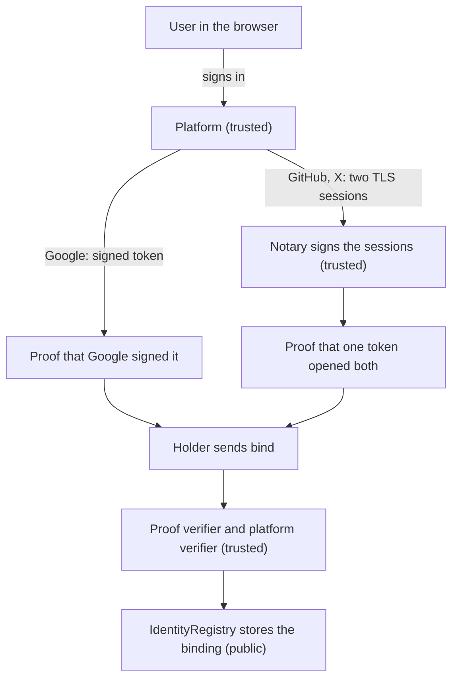

Most apps never do this themselves: the libID sign-in flow does it for the
user. This page explains what happens, so you know what a binding rests on.
The full rules are in the [specification](/specs/).

The parties marked trusted must behave: the platform says who owns the
account, the notary signs only true records, and the verifiers and their
owners check proofs correctly. What the last box stores is public on chain:
the holder, the id and the handle.

The Google path has no notary in the sign-in itself, because Google signs
its tokens. The notary still matters for Google: the contracts learn
Google's signing keys from `GoogleJwtRoots`, and anyone can update that list
with `rotate` and a notary-signed reading of Google's key list. A false
notary signature there lets a fake key bind any Google account. See
[What a binding proves](/docs/concepts/trust/#whom-you-trust).

## The steps

1. The app asks for a binding. It names the holder's address and any
   service fee. These are hashed into an authorization digest, which the proof will be tied
   to.
2. The user signs in to the platform in a popup, with the normal OAuth
   sign-in. The digest goes into the sign-in request, so the platform's answer
   is tied to this one binding.
3. The browser collects evidence.
   - For Google, the evidence is the signed sign-in token. A zero-knowledge
     proof shows that Google signed it, without putting the token on chain.
   - For GitHub and X, the browser records two sessions with the platform
     using TLSNotary: getting the access token, and asking who the user is. A
     notary signs both records. A zero-knowledge proof shows the two sessions
     used the same token.
4. The user's wallet sends `bind` to `IdentityRegistry` with the proof, paying
   `quoteBind` plus any service fee.
5. The contracts check it. `IdentityRegistry` hands the proof to the proof
   verifier, which picks the verifier for that platform and version. The
   verifier checks the proof, the notary signatures or Google's key, and the
   time limits, and
   returns the id, handle and `observedAt`.
6. `IdentityRegistry` writes the binding if the proof is for the calling
   address, has not been used, and is newer than what is stored. It emits
   `IdentityBound`.

## What it costs

- `quoteBind(platformId, version)` returns the verification fee. It is zero
  for Google. For GitHub and X it is two notary fees, one per recorded session.
- The app may add a service fee. The user approves it as part of the digest.
- Gas. Most of it goes to verifying the zero-knowledge proof.

## Where to read more

- [Common ceremony rules](/specs/ceremony-common/): the digest, PKCE, and time
  limits.
- [Identity-platform ceremonies](/specs/platform-ceremonies/): exactly what is
  read from each platform.
