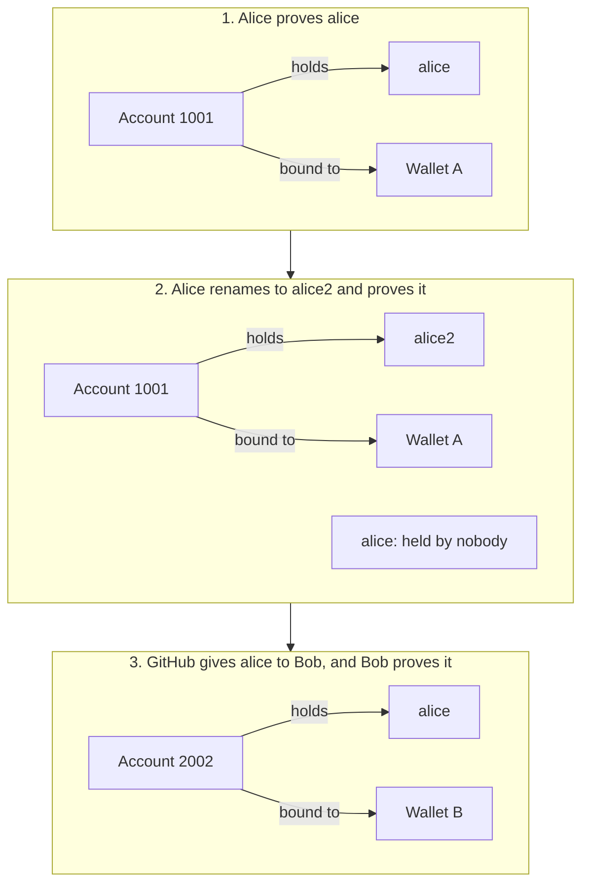

A binding links a wallet to an account, and through the account to a handle.
The two behave differently, and your app should know which one it relies on.

The account id stays the same through every step; the handle moves.
`resolveHandle('alice')` returns wallet A, then nobody, then wallet B.

## Account ids stay

An account id is fixed for the life of the account. If you need to remember
a person, remember their account id: store it, count it, or key a mapping by
it. The [airdrop example](/docs/guides/gate-contract/#an-airdrop-once-per-account)
does this.

## Handles move

A handle is a name the platform lets an account use for now. It can change
in three ways:

- The account renames itself. When it proves its new handle, the old one stops
  resolving, and `HandleRetired` is emitted.
- The platform gives an old handle to a new account. When the new account
  proves it, the handle points to the new account's wallet.
- The account moves to another wallet by proving itself from that wallet. The
  handle follows the account.

Until the new owner proves a handle, libID still points it at the last
account that did. libID only knows what someone has proved.

## What to use when

| You want to | Use |
| --- | --- |
| Let a user type a name to pay | the handle: `resolveHandle` |
| Show who a wallet is | `primaryName`, or `accountsOf` for every account |
| Remember a person across renames | the account id: `resolveId` |
| Check a handle still leads to the person you paid before | `resolvePair` with the saved account id |
| Pay someone who has not joined yet | the handle, through `HandleEscrow` |

## One wallet, many accounts

A wallet can prove any number of accounts, on the same platform or on
different ones. Each account belongs to one wallet at a time. `accountsOf`
lists them.
