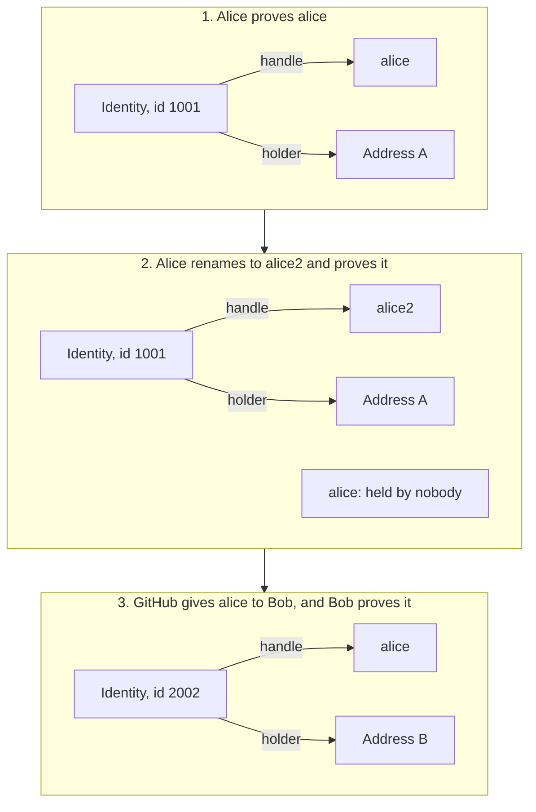

An identity is a platform account proved to a holder: the address it is bound
to. Each identity has an id, which never changes, and a handle, which can.
Your app should know which of the two it relies on.

The id stays the same through every step; the handle moves.
`resolveHandle('alice')` returns address A, then nobody, then address B.

## Ids stay

An id is fixed for the life of the platform account. If you need to remember
a person, remember their id: store it, count it, or key a mapping by it. The
[airdrop example](/docs/guides/gate-contract/#an-airdrop-once-per-identity)
does this.

## Handles move

A handle is the name a platform lets an account use for now. It can change in
three ways:

- The identity renames itself. When it proves its new handle, the old one
  stops resolving, and `HandleRetired` is emitted.
- The platform gives an old handle to a new account. When that identity proves
  it, the handle points to the new holder.
- The identity moves to another holder by proving itself from that address.
  The handle follows the identity.

Until someone proves a handle again, libID still points it at the last
identity that did. libID only knows what someone has proved.

## What to use when

| You want to | Use |
| --- | --- |
| Let a user type a handle to pay | `resolveHandle` |
| Show who an address is | `publishedHandleOf`, or `identitiesOf` for every identity |
| Remember a person across renames | the id: `resolveId` |
| Check a handle still leads to the person you paid before | `resolveHandleAndId` with the saved id |
| Pay someone who has not joined yet | the handle, through `HandleEscrow` |

## One holder, many identities

A holder can prove any number of identities, on the same platform or on
different ones. Each identity has one holder at a time. `identitiesOf` lists
them.
