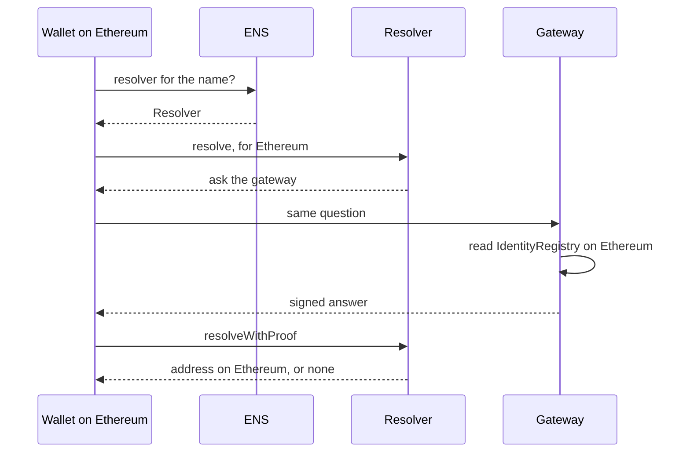

`handles.link` is a DNS name imported into ENS on Ethereum mainnet. Its
resolver is `HandleResolver`, one contract that answers for every name under
it. No name is stored anywhere.

## Resolving a name

The wallet names the chain it will send on, here Ethereum mainnet, and gets
the holder on that chain only. Today the gateway serves Ethereum mainnet
only; see [Status](/docs/ens/names/#status). `Resolver` is `HandleResolver`, set on `handles.link` in ENS
on Ethereum. The signed answer is valid for a few minutes.

1. The client asks ENS for the resolver of `octocat.github.handles.link`.
   There is none for the full name, so ENS returns the one set on
   `handles.link`.
2. The client calls `resolve` on `HandleResolver`. It replies with an
   `OffchainLookup` error that lists the gateway URLs.
3. The client asks the gateway. The gateway reads the handle from
   `IdentityRegistry` on the chain the client asked about, and signs the answer.
4. The client passes the signed answer back to `HandleResolver`, which checks
   the signature and returns the address.

Steps 2 and 4 are read-only calls. Nothing is sent and no gas is spent.

## The gateway

The gateway is part of the libID [indexer](https://github.com/libid-org/usernames-indexer).
It keeps a copy of every binding on every chain it serves. Its URL is
`https://names.handles.link/ens/{sender}/{data}.json`.

A signed answer is good for a few minutes, and `HandleResolver` refuses any
answer that claims to be good for more than an hour. So a name stops pointing
at an old holder soon after the handle changes hands.

If the gateway's copy of a chain is behind, it does not answer for that chain.
The client then tries the next URL, or gets no address.

An answer the gateway has already signed stays valid until it expires, a few
minutes later. A client that cached it can still use it in that time, even if
the handle changed holder in between.

## What you trust

When you resolve through ENS, you trust:

- the gateway's signing key,
- the owner of `HandleResolver`, who chooses which keys and URLs it accepts,
- the owner of `handles.link` in ENS, who can point the name at another
  resolver with `setResolver`, and
- whoever controls the DNS zone of `handles.link`. It is a DNS name imported
  into ENS, so control of the zone can claim the ENS name again.

The libID team runs all of them. On Ethereum mainnet one key,
`0x7e00d33b5c571ca2b2879309C4846Ddd80f4128e`, owns both `handles.link` and
`HandleResolver`. It also owns the libID contracts; see
[Security](/docs/resources/security/#admin-keys). When you call `IdentityRegistry` yourself, you
trust neither: your code reads the chain directly. Use `IdentityRegistry` when
the amount at stake is large.
