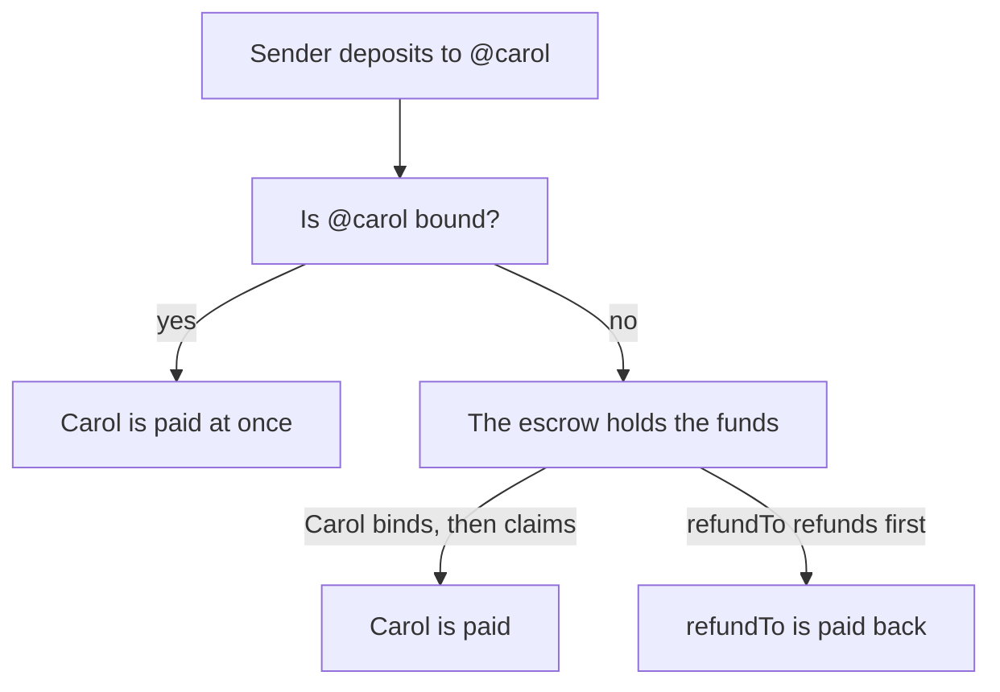

`HandleEscrow` lets you send ETH or tokens to a handle such as `@carol` on
GitHub. If Carol has already proved the handle, she gets the funds right away.
If not, the escrow holds them. Then one of two things happens: Carol proves
the handle and claims the funds, or the sender takes them back first.



A paid deposit emits `Forwarded`, a held one `Deposited`. Held funds end one
of two ways, `Claimed` or `Refunded`, whichever comes first.

In this guide you play both people: a sender, with `PRIVATE_KEY`, and Carol,
with `CAROL_KEY`. Set them, and `HANDLE_ESCROW`, as
[Test on a local chain](/docs/guides/local-chain/) shows. Binding Carol's
handle without a real proof needs the local-chain project, which is not
published yet. On other networks, Carol binds with the libID sign-in flow.

## The sender's script

Create `sender.mjs`. Start with the setup:

```js
import { createPublicClient, createWalletClient, http } from 'viem';
import { privateKeyToAccount } from 'viem/accounts';
import { handleEscrowAbi, handleHash, handleNode, platformId, rulesOf } from '@libid/contracts';

const transport = http(process.env.RPC_URL);
const client = createPublicClient({ transport });
const registry = { client, address: process.env.IDENTITY_REGISTRY };
const escrow = { address: process.env.HANDLE_ESCROW, abi: handleEscrowAbi };

const NATIVE = '0xEeeeeEeeeEeEeeEeEeEeeEEEeeeeEeeeeeeeEEeE';
```

`NATIVE` is the address the escrow uses for ETH.

### Hash the handle

The escrow takes the handle as a hash. Compute it on your side, so the
handle itself is never sent to the RPC:

```js
const sender = createWalletClient({ account: privateKeyToAccount(process.env.PRIVATE_KEY), transport });

const rules = await rulesOf(registry, platformId('github'));
const hash = handleHash('carol', rules);
const node = handleNode(platformId('github'), hash);
```

`rulesOf` reads how the platform writes handles. GitHub and X both ignore
case and drop a leading `@`; they differ in which characters they allow. `handleHash` applies those rules and hashes
the result. It throws if the text can never be a handle on that platform.
`handleNode` is the key the escrow keeps the funds under.

### Send

```js
async function send(amount) {
  const tx = await sender.writeContract({
    ...escrow,
    functionName: 'deposit',
    args: [platformId('github'), hash, NATIVE, amount, sender.account.address],
    value: amount,
  });
  await client.waitForTransactionReceipt({ hash: tx });
}

await send(10n ** 16n); // 0.01 ETH
```

The arguments are the platform, the handle hash, the token, the amount, and
the address that may take the funds back. For ETH, `value` must equal
`amount`.

If someone already owns the handle, the escrow pays them in the same
transaction and emits `Forwarded`. Otherwise it keeps the funds and emits
`Deposited`. Nobody owns `carol` on the local chain yet, so the escrow keeps
them.

### Check what is held

```js
const held = await client.readContract({ ...escrow, functionName: 'escrowed', args: [node, NATIVE] });
console.log('held for carol:', held);
```

### Take it back

Until Carol claims, the `refundTo` address of a deposit can take it back.
The sender named itself as `refundTo`, so it can call `refund`:

```js
const tx = await sender.writeContract({
  ...escrow,
  functionName: 'refund',
  args: [node, NATIVE, sender.account.address],
});
await client.waitForTransactionReceipt({ hash: tx });
```

The last argument is where the funds go. `refundable(node, token, address)`
tells you how much a refund would return.

A refund and a claim are alternatives: whichever comes first gets the funds.
So that Carol has something to claim in the next step, send again:

```js
await send(10n ** 16n);
```

Run it:

```sh
node sender.mjs
```

## Carol proves her handle

In a real app, Carol proves `carol` on GitHub with the libID sign-in flow,
which binds the handle to her address. See
[How binding works](/docs/advanced/how-binding-works/). On the
[local chain](/docs/guides/local-chain/#the-guides-test-data), bind it from
the `local-chain` directory:

```sh
./bind.sh github 777 carol $CAROL_KEY
```

## Carol's script

Create `carol.mjs`, starting with the same setup as `sender.mjs`, then:

```js
const carol = createWalletClient({ account: privateKeyToAccount(process.env.CAROL_KEY), transport });
const node = handleNode(platformId('github'), handleHash('carol', await rulesOf(registry, platformId('github'))));

const tx = await carol.writeContract({
  ...escrow,
  functionName: 'claim',
  args: [node, [NATIVE], carol.account.address],
});
await client.waitForTransactionReceipt({ hash: tx });

console.log('left for carol:', await client.readContract({ ...escrow, functionName: 'escrowed', args: [node, NATIVE] }));
```

`claim` must come from the holder of the handle. The second argument
lists the tokens to claim; tokens with nothing held are skipped. The third is
where the funds go.

```sh
node carol.mjs
```

After a claim, the sender can no longer refund the deposits Carol took.

## Send tokens

To send an ERC-20 token, approve the escrow first, then pass the token's
address instead of `NATIVE` and leave out `value`.

Tokens that charge a fee when they send, and tokens whose balances change on
their own, do not work with the escrow.

## Things to know

- A wrong hash sends funds to a slot nobody can claim. Only the refund
  address can get them back.
- A handle can change holders. Before you send, you can show when the
  current holder proved it. See [Resolve a handle](/docs/guides/resolve-handle/).
- The refund address should be your user. If a contract sends on a user's
  behalf and names itself, the user cannot get the funds back.
